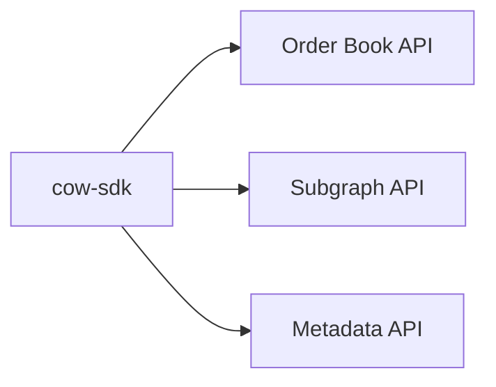

# CoW Protocol SDK

A comprehensive SDK for interacting with the CoW Protocol, providing a modular and flexible architecture for different web3 provider implementations.

## Project Structure

The SDK is organized as a monorepo containing the following key packages:

### Core Packages
- `cow-sdk`: The main SDK package providing core functionality
- `cow-order-book`: Order book API implementation
- `cow-subgraph`: Subgraph API for accessing on-chain data
- `cow-trading`: Trading functionality implementation
- `cow-common`: Shared utilities and types

### Web3 Provider Implementations
- `cow-sdk-ethers-v5`: Implementation for ethers.js v5
- `cow-sdk-ethers-v6`: Implementation for ethers.js v6
- `cow-sdk-viem`: Implementation using viem
- `cow-sdk-wagmi`: Implementation for wagmi hooks

### Support Packages
- `cow-abi`: Contract ABIs
- `cow-config`: Configuration utilities
- `cow-composable`: Composable order utilities
- `cow-order-signing`: Order signing utilities
- `config-typescript`, `config-eslint`: Shared configurations

## Architecture

The SDK is built around three main APIs:

1. **Order Book API**: Manages orders lifecycle (creation, querying, cancellation)
2. **Subgraph API**: Provides access to indexed on-chain data
3. **Metadata API**: Handles order metadata encoding/decoding

### Key Features
- Provider-agnostic core functionality
- Modular architecture allowing flexible web3 provider integration
- Comprehensive order management system
- Type-safe implementations

## Component Interactions



The SDK provides a unified interface while maintaining clear separation between:
- Core protocol interactions
- Web3 provider implementations
- Support utilities

## Development

### Building
```bash
pnpm install
pnpm build
```

### Development Mode
```bash
pnpm dev
```

## Architecture Decisions

1. **Provider Agnostic Core**: The core SDK functionality is separated from web3 provider implementations, allowing for:
   - Easy integration of new providers
   - Maintenance of provider-specific optimizations
   - Reduced dependency conflicts

2. **Monorepo Structure**: Using Turborepo for:
   - Consistent development experience
   - Efficient build caching
   - Clear package boundaries

3. **Type Safety**: Comprehensive TypeScript implementation across all packages

### Current Implementation vs. Future Goals

While the architecture is designed to be provider-agnostic, some aspects are still in transition:
- Currently, only `cow-sdk-ethers-v5` has a direct dependency on ethers.js
- Future implementations will further isolate provider dependencies
- The goal is to maintain clean boundaries between core functionality and provider-specific code

## Remote Caching

The project uses Turborepo's Remote Caching feature for improved build performance across teams and CI/CD pipelines. To enable Remote Caching:

1. Authenticate with Vercel:
```bash
npx turbo login
```

2. Link your Turborepo to Remote Cache:
```bash
npx turbo link
```

## Useful Links

Learn more about Turborepo features:
- [Pipelines](https://turborepo.org/docs/core-concepts/pipelines)
- [Caching](https://turborepo.org/docs/core-concepts/caching)
- [Remote Caching](https://turborepo.org/docs/core-concepts/remote-caching)
- [Configuration Options](https://turborepo.org/docs/reference/configuration)
